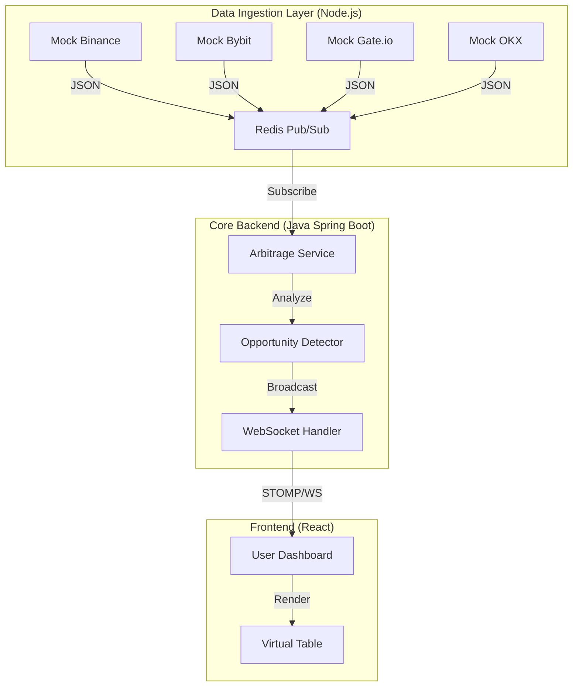

# XYVOX Spreads — High-Frequency Crypto Arbitrage Scanner


> **⚠️ PORTFOLIO DEMO VERSION**
>
> This repository is a **public demonstration** of the XYVOX architecture.
> To protect proprietary trading strategies and intellectual property:
> 1.  **Core Arbitrage Algorithms** (Graph traversal/Bellman-Ford) have been replaced with **stubs**.
> 2.  **Live Exchange Connections** (Binance/Bybit APIs) have been replaced with **stochastic market simulators** (Geometric Brownian Motion).
> 3.  **API Keys** are not required to run this demo.
>
> *The system architecture, microservices orchestration, data pipelines, and frontend visualization are fully functional and identical to the production version.*

---

##  Live Demo


https://github.com/user-attachments/assets/5181e991-b0a9-477f-b2d7-3fc8a18618c1


---

##  System Architecture

The system is designed for **low-latency** processing of market data from 6+ major exchanges.



## Key Components
### Ingestion Service (Node.js Cluster):

- In Production: Connects to Exchange WebSockets, handles reconnects, normalizes order books.

- In Demo: Generates realistic price movements using Random Walk algorithms to simulate volatility and spread formation.

# Core Backend (Spring Boot):

- Consumes high-throughput stream from Redis.

- Builds local snapshots of order books.

- Calculates cross-exchange spreads (Spot vs. Perp, Perp vs. Perp).

- Broadcasts updates to frontend via STOMP WebSockets.

### Frontend (React + TypeScript):

- Highly optimized TableVirtuoso for rendering 1000+ rows without lag.

- Real-time visual cues (flashing cells) for price changes.

- Zustand for global state management.

## Quick Start (Docker)

You can run the full stack locally with a single command. No configuration or API keys needed.

###Prerequisites
- Docker & Docker Compose installed.

###Installation

1. Clone the repository:
```bash
  git clone [https://github.com/Bulochk1n/xyvox-spreads-demo.git](https://github.com/Bulochk1n/xyvox-spreads-demo.git)
  cd xyvox-spreads-demo
```

2. Start the services:
```bash
  docker-compose up --build -d
```

  This will spin up Postgres, Redis, the Java Backend, 6 Node.js mock workers, and the Frontend Nginx.

3. Access the Dashboard: Open your browser and navigate to: http://localhost

## Tech Stack

### Backend
- Java 21 & Spring Boot 3: Core logic.

- WebSockets (STOMP): Real-time data push to clients.

- PostgreSQL: Storing historical opportunities (disabled in demo for performance).

- Lombok: Reducing boilerplate.

### Data & Infrastructure
- Redis: High-speed Pub/Sub bus for decoupling Ingestors from the Backend.

- Docker Compose: Orchestration of 10+ containers.

- Node.js: Lightweight services for API connectivity (simulated).

### Frontend
- React 19: UI Library.

- TypeScript: Type safety.

- Tailwind CSS: Styling.

- React Virtuoso: Virtual scrolling for performance.

- Zustand: State management.

- Lucide React: Icons.

##Simulation Details
Since this is a portfolio piece, I wanted to ensure the dashboard looks "alive" without requiring the reviewer to have Binance API keys.

- Price Generation: Each "Worker" container runs a Brownian Motion script found in prices-service/ingest-stream.js.

- Latency Simulation: The services artificially introduce network jitter (100ms - 800ms) to mimic real-world conditions.

- Demo Boost: The Java backend applies a slight bias to spread calculations to ensure "Arb Opportunities" appear frequently on the screen for demonstration purposes.

##Project Structure
```bash
├── core-backend/       # Spring Boot Application
│   ├── src/main/java/xyvoxspreads...
│   │   ├── service/    # Arbitrage logic (ArbitrageService.java)
│   │   ├── model/      # DTOs and Entities
│   │   └── config/     # WebSocket & Redis Config
│   └── Dockerfile
│
├── prices-service/     # Node.js Microservices
│   ├── ingest-stream.js   # The Mock Data Generator
│   ├── strategies/        # Mock metadata strategies
│   └── Dockerfile
│
├── xyvox-frontend/     # React Application
│   ├── src/components/ # Table, Header, Filters
│   ├── src/store/      # Zustand stores
│   └── Dockerfile
│
└── docker-compose.yml  # Orchestration
```

##Contact
Project created by Danila.
- LinkedIn: https://www.linkedin.com/in/danila-novik
- GitHub: https://github.com/Bulochk1n
- TG: https://t.me/novikdanik
- Email: danilanovik8@gmail.com
  
